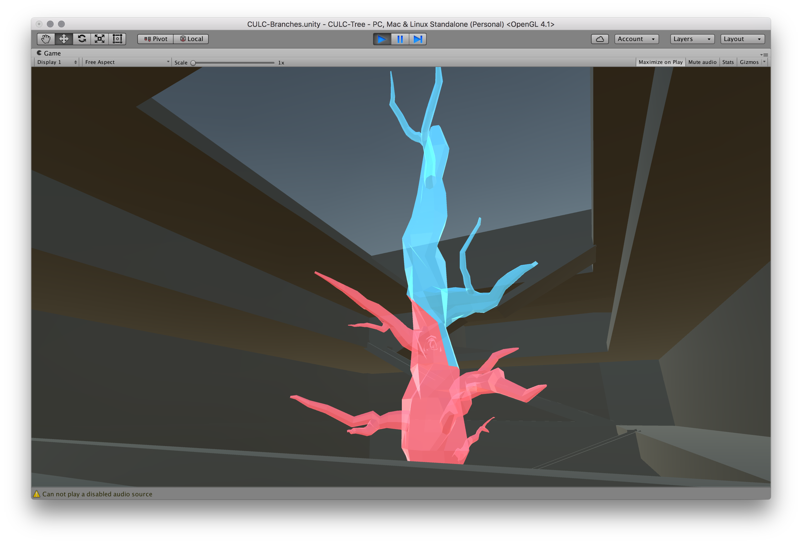

# The-Hive
The Hive is a research project created for CS8803 at Georgia Tech's MS-HCI program. The hive aims to solve the problem of students struggling to find a seating spot in the Clough Undergraduate Learning Commons (CULC), GT's library.

The Hive is one solution conceived for this problem, a solution which combines both art and design. This Unity demo is a first person controlled virtual environment of the CULC, with the notable addition of a luminescent tree. That tree is the Hive, a tree meant to guide students to open seating areas in the CULC through the use of color on its branches. The branches themselves to seating areas, and the colors indiciate either full or available to students.

The Hive aims to be simple and intuitive, if implemented, a student could simply walk in, check the status of the tree, and decide if they want to study at the CULC or not after assessing how full the building is.

This Unity demo was created for usability testing purposes, to see if the tree's purpose could be understood without any instruction and whether it proved to be useful in finding a seat versus the current method of simply wandering around until you find one. Users would try to find a seat in a CULC without the Hive, then with the Hive, and answered a few post play session questions. Our studies showed, that, yes, it is useful, with most seating times cut by half, and positive feedback from users.

If you're interested in reading more about the design process and the results, please visit [my portfolio page for this project](http://philkt.me/portfolio/hive).

## Controls
WASD or arrow keys to move, mouse to look around.

## Where to play
[Click here](http://philkt.me/The-Hive)

## Screenshots

